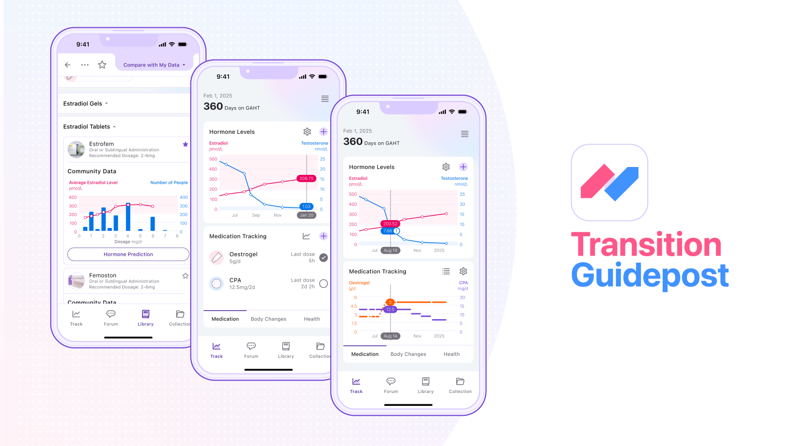
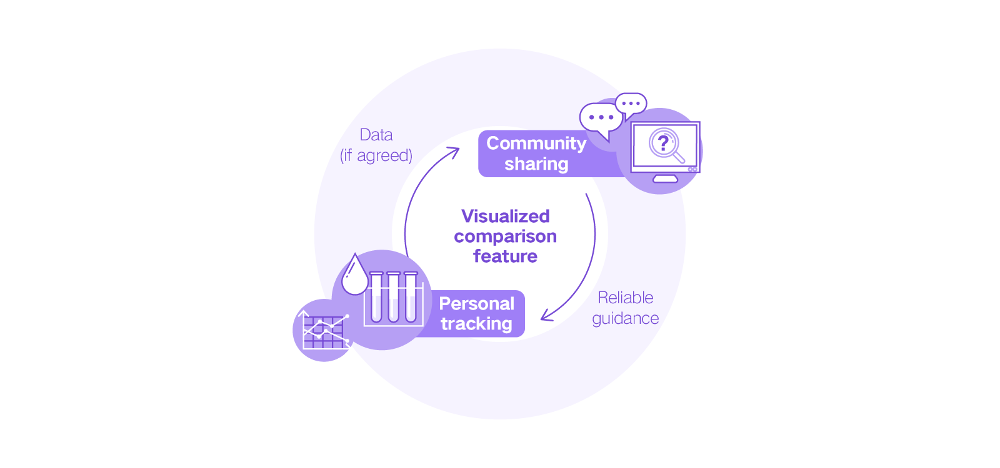
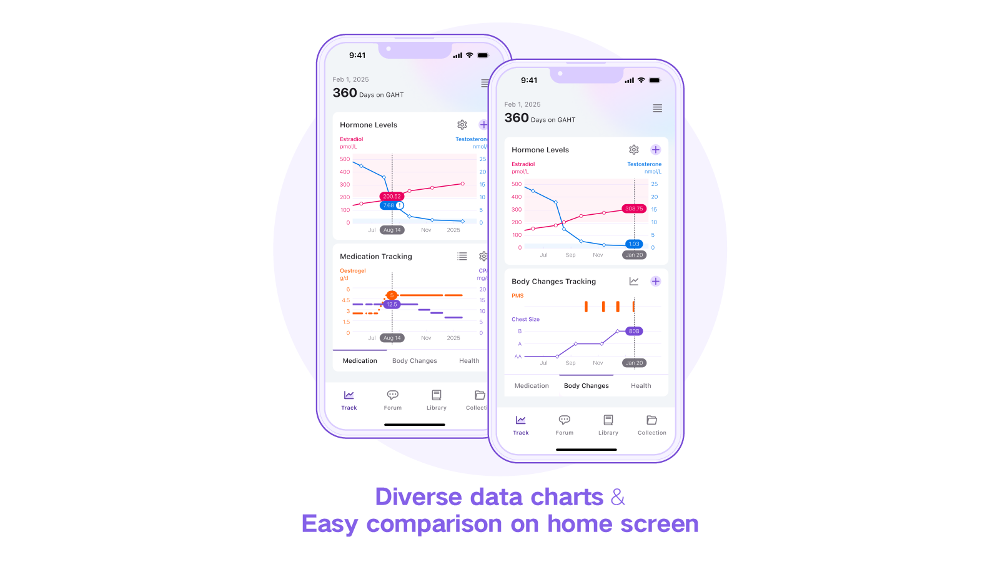
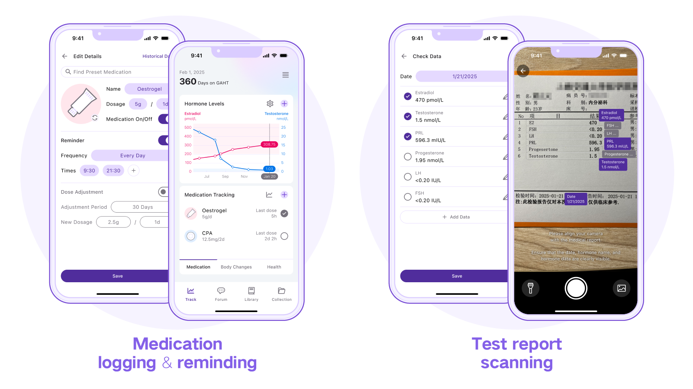
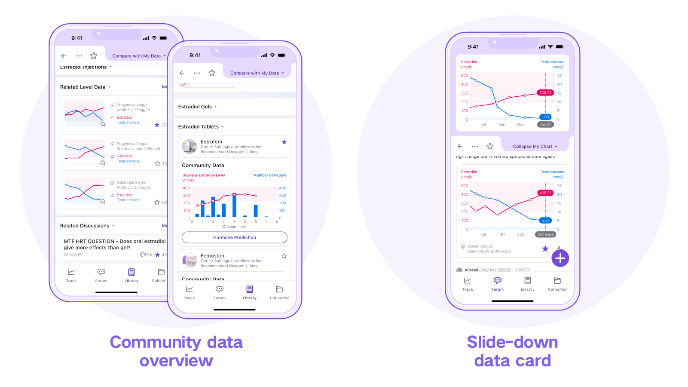
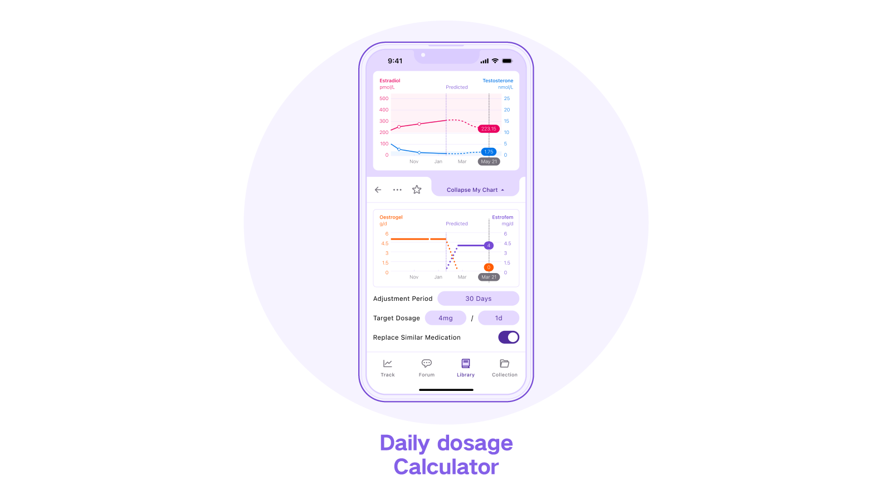
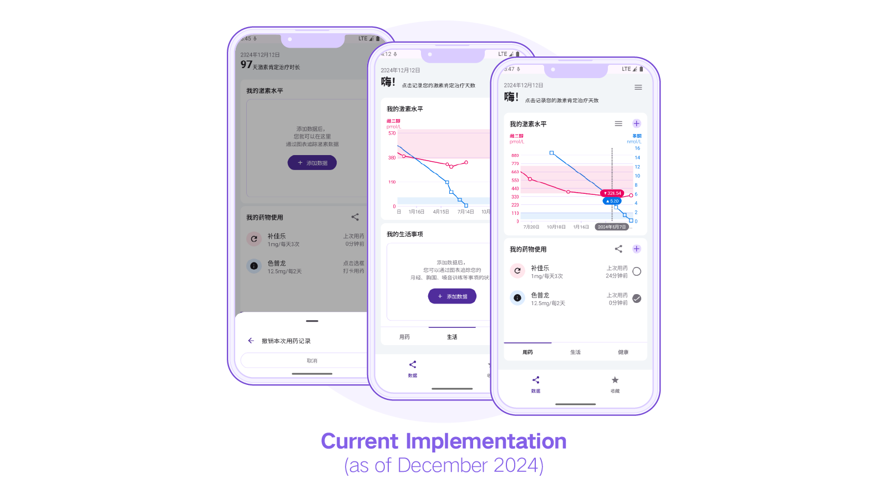

## Transition Guidepost

#### Introduction

Transition Guidepost is a data-tracking, comparing, and sharing app designed for gender-affirming hormone therapy (GAHT/HRT). The app is currently developed using Kotlin and Jetpack Compose, and its chart feature is realized by the Vico chart library.

Many transgender individuals in DIY GAHT/HRT have to gather medication and hormone information from different sources, keep tracking diverse health data, and analyse them to adjust their medications. These can cause many pain points, including difficulties in collecting and evaluating reference data, as well as recording and analysing personal test data to understand the interactions and potential problems through them.

Transition Guidepost manages to address these pain points by convenient data tracking, comparing, and sharing features. Firstly, users can input GAHT/HRT hormone and medication data easily, visualize different types of data and compare them in the same screen and time scope, and analyse their trends and how different factors influence each other. Secondly, users can share their data with the community, making it easier to find similar cases for reference. As the amount of shared data grows, this app can also provide common dosages and average hormone levels for users as reliable guidance.

#### Planned Main Features

**Visualized Data Tracking and Comparing**

- **Diverse data charts**: The user can track hormone levels, medications, lifestyle factors, and health test results using various chart types to analyse their trends, interactions, and whether they achieved the target value.
- **Easy comparison on home screen**: The home screen displays two charts at the same time. The user can directly compare and analyse chart data and easily show it to doctors or community members.

**Quick Data Input**

- **Medication logging and reminding**: The user can log doses with a single tap on the home screen, and the medication data is automatically recorded.

- **Test report scanning**: The user can scan medical test reports to input hormone data directly.

**Community Data Reference**

- **Community data overview**: The user can view the most common dosages and corresponding average hormone levels shared by other users, and share their personal data with the community for mutual aid.
- **Slide-down data card**: The user can conveniently compare their data with others' using a slide-down data card when they are viewing others' data.

**Other Features**

- **Daily dosage Calculator**: When the user is adjusting their medications, the app can automatically calculate daily medication dosages.
- **Automatic unit conversion**: The user can record hormone data in any unit, and the app can convert them automatically.

#### Current Work

- Realizing the chart feature using the Vico chart library. (The hormone chart is nearly complete and the other charts' work is about to start).
- Designing and developing the GAHT/HRT start date input screen.
- Completing the chart style adjustment screen for the hormone chart.
- Completing the new medication item adding screen.

